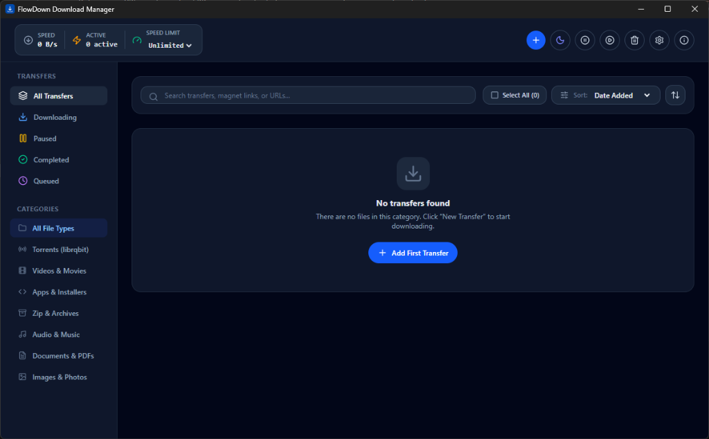

<p align="center">
  
</p>

# <p align="center">FlowDown Download Manager</p>

<p align="center">
  A fast, lightweight, specialized desktop download manager built with <b>Tauri v2</b>, <b>React</b>, and <b>librqbit</b> for high-performance HTTP and BitTorrent transfers with stealth protocol encryption.
</p>

<p align="center">
  
</p>

---

## Overview & Usage

FlowDown is designed as a **manual-style download manager**:

- **Manual Link Input**: Links are added by either copying & pasting URLs into the transfer dialog or by directly dragging and dropping links / files into the application window.
- **Protocol Handling**:
  - **BitTorrent & Magnet Links**: FlowDown can register as your system's default handler for `.torrent` files and `magnet:` links, launching automatically when opened from your browser or file manager.
  - **HTTP/HTTPS Transfers**: FlowDown is a **manual downloader** for direct web files — it **does not** automatically intercept or catch HTTP/HTTPS downloads from your browser. Paste or drop the direct download link into the app to start downloading.

---

## Key Features

- **Multi-protocol Support**: High-speed multi-connection HTTP(S) downloads with dynamic byte-range probing, plus full BitTorrent support via `librqbit`.
- **Stealth Protocol Shield**: Anti-throttling traffic obfuscation, randomized ports, client spoofing, and forced BitTorrent protocol encryption.
- **Drag & Drop Workflow**: Drag links directly from your browser or `.torrent` files from your desktop into the FlowDown window.
- **Automatic GitHub Updates**: Built-in updater with cryptographic signature verification that checks for new releases directly from GitHub.
- **Speed & Bandwidth Controls**: Global and per-transfer speed limits, pause/resume queues, and categorized downloads.
- **Native OS Integration**: Clean window state persistence, light/dark themes, and system notifications.

---

## Getting Started

### Prerequisites

- [Node.js](https://nodejs.org/) (v18+)
- [Rust](https://www.rust-lang.org/) (stable toolchain)

### Installation

```bash
# Clone the repository
git clone https://github.com/z-software-labs/flowdown.git
cd flowdown

# Install dependencies
npm install

# Start development server with Tauri desktop window
npm run tauri dev
```

### Production Build

```bash
npm run tauri build
```

The compiled installer and standalone executable will be generated in `src-tauri/target/release/bundle/`.

---

## License

This project is licensed under the [MIT License](https://opensource.org/licenses/MIT).
